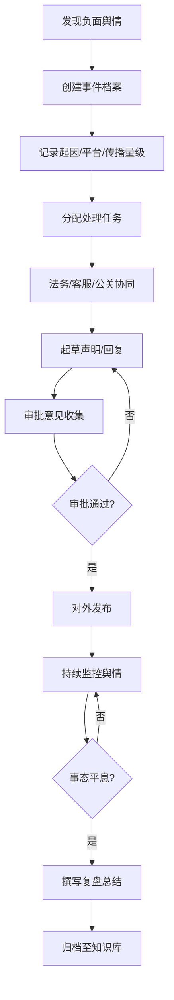
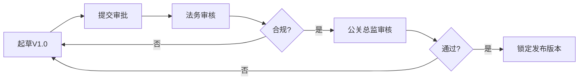

## 1. 产品概述

企业公关危机事件管理平台，专为品牌公关团队设计，提供从舆情发现、事件响应、协同处理到复盘归档的全流程管理能力。

- 核心价值：帮助企业系统化应对公关危机，提升响应效率，减少声誉损失
- 目标用户：品牌公关团队、法务部、客户服务部、管理层

## 2. 核心功能

### 2.1 用户角色

| 角色 | 注册方式 | 核心权限 |
|------|---------|---------|
| 管理员 | 系统创建 | 全局配置、用户管理、事件创建/归档、所有权限 |
| 公关专员 | 管理员创建 | 事件管理、任务分配、声明编辑、舆情录入 |
| 法务顾问 | 管理员创建 | 法律审核、审批意见、查看事件详情 |
| 客服代表 | 管理员创建 | 处理客服任务、录入用户反馈信息 |
| 只读用户 | 管理员创建 | 查看事件详情、知识库 |

### 2.2 功能模块

1. **仪表盘首页**：事件概览、关键指标、待办任务、活跃事件列表
2. **事件管理**：事件列表、新建事件、事件详情、事件搜索筛选、状态流转
3. **任务管理**：任务列表、任务分配、优先级设置、截止时间、进度跟踪
4. **沟通中心**：声明草稿、媒体回复、内部汇报、版本历史、协同编辑、审批意见
5. **舆情监控**：提及量录入、情感倾向记录、趋势图表、平台分布
6. **事件时间线**：从爆发到平息的全流程时间节点记录
7. **复盘总结**：得失分析、改进建议、评分评级
8. **知识库**：历史案例归档、分类检索、相似案例推荐

### 2.3 页面详情

| 页面名称 | 模块名称 | 功能描述 |
|---------|---------|-----------|
| 仪表盘 | 数据概览卡片 | 活跃事件数、待处理任务、本月已平息事件、高风险预警 |
| 仪表盘 | 事件趋势图 | 月度事件数量趋势、事件严重程度分布 |
| 仪表盘 | 待办任务列表 | 按优先级展示当前用户待办任务 |
| 仪表盘 | 活跃事件列表 | 进行中的危机事件快速入口 |
| 事件列表 | 筛选工具栏 | 按状态、严重程度、时间、关键词筛选 |
| 事件列表 | 事件卡片/表格 | 展示事件摘要信息，支持切换视图 |
| 事件列表 | 新建事件按钮 | 弹窗表单创建新事件档案 |
| 事件详情 | 基本信息面板 | 事件起因、发现时间、涉及平台、传播量级 |
| 事件详情 | 状态流转栏 | 待处理→响应中→处理中→监控中→已平息→已归档 |
| 事件详情 | 任务面板 | 本事件相关任务，支持创建、分配、更新 |
| 事件详情 | 沟通空间 | 声明/回复/汇报文档列表，版本管理，协同编辑 |
| 事件详情 | 舆情数据 | 数据录入表单、趋势折线图、情感占比 |
| 事件详情 | 时间线 | 关键节点时间轴，支持新增事件 |
| 事件详情 | 复盘表单 | 事件平息后填写复盘总结 |
| 任务中心 | 全部任务列表 | 跨事件任务视图，按截止时间/优先级排序 |
| 沟通中心 | 文档编辑器 | 富文本编辑器，支持协同编辑痕迹 |
| 沟通中心 | 版本对比 | 历史版本差异对比 |
| 沟通中心 | 审批流程 | 提交审批、审批意见记录、审批状态追踪 |
| 知识库 | 分类浏览 | 按事件类型、行业、严重程度分类 |
| 知识库 | 案例详情 | 完整历史事件查看，包含复盘总结 |
| 知识库 | 搜索 | 全文检索关键词 |

## 3. 核心流程

### 3.1 危机事件响应流程

发现负面舆情后，公关团队创建事件档案，记录关键信息。系统自动生成初始任务，管理员分配法务、客服、公关人员协同处理。团队在沟通空间内共同起草声明，经审批后对外发布。持续录入舆情数据监控事态发展。事件平息后撰写复盘总结，归入知识库供未来参考。

### 3.2 声明审批流程

## 4. 用户界面设计

### 4.1 设计风格

**整体方向：专业沉稳的企业级风格（Corporate & Trustworthy）**

- **主色调**：深海蓝 #0F3460（专业、可信、稳重）
- **辅助色**：
  - 警示红 #E94560（危机/紧急/高风险）
  - 警戒橙 #FF9F43（中风险/注意）
  - 成功绿 #10B981（已平息/正常）
  - 信息青 #06B6D4（进行中/关注）
- **中性色**：深灰 #1E293B、中灰 #64748B、浅灰 #F1F5F9、纯白 #FFFFFF
- **按钮风格**：圆角矩形（圆角8px），主色填充，悬停有细微阴影加深
- **字体方案**：
  - 标题：Noto Serif SC（衬线体，传递专业权威感）
  - 正文：Noto Sans SC（无衬线体，清晰易读）
  - 数字/代码：JetBrains Mono
- **布局风格**：左侧导航栏 + 顶部状态栏 + 主内容区，卡片式模块，适当留白
- **图标风格**：Lucide React 线性图标，统一 20px 尺寸，线条宽度 1.5px

### 4.2 页面设计概览

| 页面名称 | 模块名称 | UI元素 |
|---------|---------|-------|
| 仪表盘 | 数据概览卡片 | 渐变背景卡片、图标+数字+趋势箭头、悬停上浮效果 |
| 仪表盘 | 事件趋势图 | 面积图+折线图叠加、交互式tooltip |
| 事件列表 | 状态标签 | 胶囊型彩色标签（红/橙/青/绿/灰），带状态小圆点 |
| 事件详情 | 时间线 | 左侧垂直线+节点圆点+时间戳+事件描述卡片 |
| 事件详情 | 严重程度指示 | 1-5级进度条，颜色从绿到红渐变 |
| 沟通中心 | 版本标签 | V1.0、V1.1样式，最新版本高亮边框 |
| 沟通中心 | 编辑器 | 左右分栏：左侧编辑区，右侧审批意见侧边栏 |
| 知识库 | 案例卡片 | 封面色条（按严重程度配色）+ 标题 + 摘要 + 标签 |

### 4.3 响应式设计

- 桌面端优先设计（1280px+），主内容区采用 12 栅格布局
- 平板端（768-1279px）：左侧导航折叠为图标栏，主内容区全宽
- 移动端（<768px）：顶部汉堡菜单导航，卡片单列排布，表格转为卡片视图

### 4.4 交互与动画

- 页面首次加载：侧边栏先出现，主内容区元素按模块依次淡入（stagger 100ms）
- 卡片悬停：translateY(-2px) + 阴影加深，过渡 200ms ease
- 状态变化：颜色渐变过渡 300ms，配合图标微旋转动画
- 时间线节点：悬停时节点放大，弹出详细信息气泡
- 紧急事件：红色边框闪烁动画（pulse 2s infinite）提醒关注
