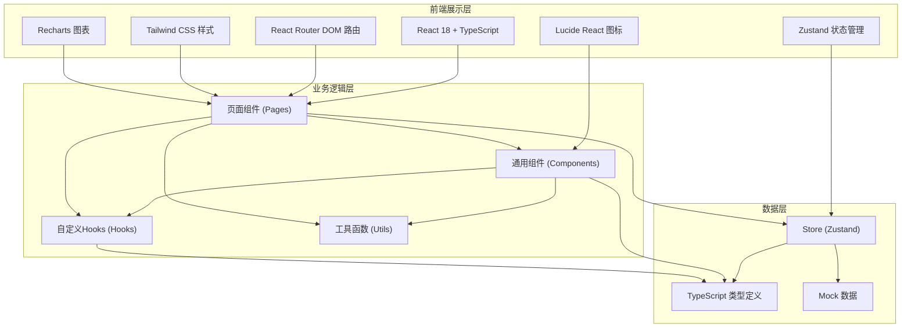
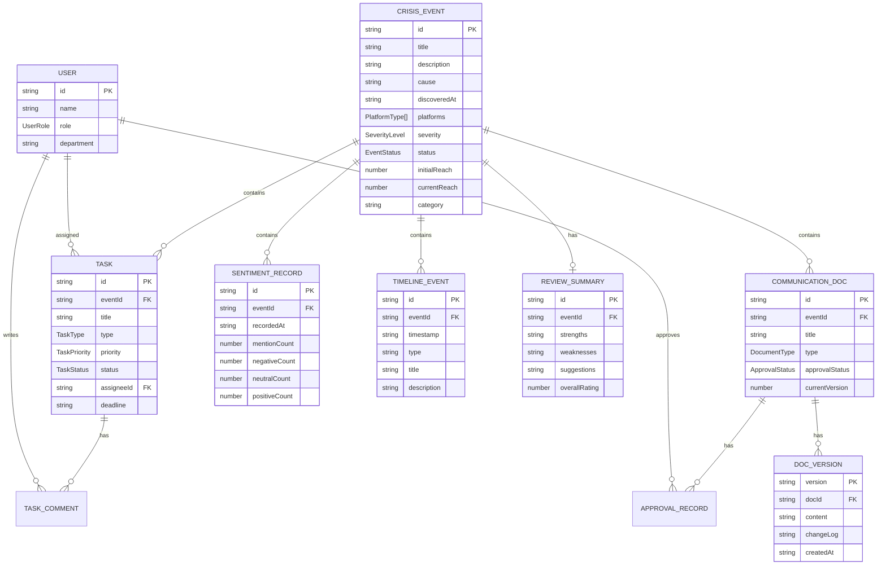

## 1. 架构设计



## 2. 技术描述

- **前端框架**：React@18 + TypeScript@5 + Vite@5
- **路由方案**：React Router DOM@6
- **样式方案**：Tailwind CSS@3 + CSS Variables 主题系统
- **状态管理**：Zustand@4（轻量、简洁、适合中型应用）
- **UI 组件**：基于 Tailwind 自研组件库 + Lucide React 图标
- **图表库**：Recharts@2（原生 React 图表，体积小易定制）
- **富文本编辑**：使用 Textarea + 自定义 Markdown 风格工具栏（简化实现）
- **数据方案**：前端 Mock 数据 + localStorage 持久化，无后端依赖
- **包管理器**：npm
- **初始化工具**：vite-init (react-ts 模板)

## 3. 路由定义

| 路由路径 | 页面组件 | 用途描述 |
|---------|---------|---------|
| `/` | Dashboard | 仪表盘首页，事件概览、待办任务 |
| `/events` | EventList | 事件列表，全部危机事件管理 |
| `/events/new` | EventCreate | 创建新事件档案 |
| `/events/:id` | EventDetail | 事件详情页（包含子标签页切换） |
| `/events/:id/overview` | EventDetail | 事件概览与基本信息 |
| `/events/:id/tasks` | EventDetail | 本事件的任务管理 |
| `/events/:id/communications` | EventDetail | 沟通空间（声明/版本/审批） |
| `/events/:id/sentiment` | EventDetail | 舆情数据与趋势 |
| `/events/:id/timeline` | EventDetail | 事件时间线 |
| `/events/:id/review` | EventDetail | 复盘总结填写 |
| `/tasks` | TaskCenter | 跨事件任务中心 |
| `/knowledge` | KnowledgeBase | 知识库与历史案例 |
| `/knowledge/:id` | KnowledgeDetail | 案例详情查看 |

## 4. 类型定义（核心数据模型）

```typescript
// 事件状态枚举
type EventStatus = 'pending' | 'responding' | 'processing' | 'monitoring' | 'resolved' | 'archived';

// 事件严重程度 1-5级
type SeverityLevel = 1 | 2 | 3 | 4 | 5;

// 涉及平台
type PlatformType = 'weibo' | 'wechat' | 'douyin' | 'xiaohongshu' | 'zhihu' | 'baidu' | 'media' | 'other';

// 任务类型
type TaskType = 'legal' | 'customer_service' | 'pr' | 'management' | 'other';

// 任务优先级
type TaskPriority = 'urgent' | 'high' | 'medium' | 'low';

// 任务状态
type TaskStatus = 'todo' | 'in_progress' | 'review' | 'completed' | 'cancelled';

// 文档类型
type DocumentType = 'statement' | 'media_reply' | 'internal_report' | 'other';

// 情感倾向
type SentimentType = 'negative' | 'neutral' | 'positive';

// 审批状态
type ApprovalStatus = 'draft' | 'pending' | 'approved' | 'rejected';

// 用户角色
type UserRole = 'admin' | 'pr' | 'legal' | 'cs' | 'viewer';

// --- 核心实体 ---

interface User {
  id: string;
  name: string;
  role: UserRole;
  avatar?: string;
  email: string;
  department: string;
}

interface CrisisEvent {
  id: string;
  title: string;
  description: string;           // 事件起因描述
  cause: string;                 // 具体起因
  discoveredAt: string;          // 初次发现时间 ISO
  reportedAt: string;            // 录入系统时间
  platforms: PlatformType[];     // 涉及平台
  initialReach: number;          // 初始传播量级（预估人数）
  severity: SeverityLevel;       // 严重程度
  status: EventStatus;           // 当前状态
  statusHistory: { status: EventStatus; changedAt: string; changedBy: string; note?: string }[];
  tags: string[];                // 标签
  category: string;              // 事件分类（产品/服务/人事/财务/其他）
  createdBy: string;
  assignees: string[];           // 参与成员ID
  currentReach?: number;         // 当前传播量级
  peakReach?: number;            // 峰值传播量级
  resolvedAt?: string;           // 平息时间
  archivedAt?: string;           // 归档时间
}

interface Task {
  id: string;
  eventId: string;
  title: string;
  description: string;
  type: TaskType;
  priority: TaskPriority;
  status: TaskStatus;
  assigneeId: string;            // 负责人
  assignorId: string;            // 分配人
  createdAt: string;
  deadline: string;              // 截止时间
  completedAt?: string;
  attachments?: string[];
  comments?: TaskComment[];
}

interface TaskComment {
  id: string;
  taskId: string;
  userId: string;
  content: string;
  createdAt: string;
}

interface CommunicationDoc {
  id: string;
  eventId: string;
  title: string;
  type: DocumentType;
  versions: DocVersion[];
  currentVersion: number;        // 主版本号
  approvalStatus: ApprovalStatus;
  approvals: ApprovalRecord[];
  createdAt: string;
  createdBy: string;
}

interface DocVersion {
  version: string;               // 如 "1.0", "1.1"
  content: string;               // Markdown 内容
  createdAt: string;
  createdBy: string;
  changeLog: string;             // 变更说明
}

interface ApprovalRecord {
  id: string;
  docId: string;
  version: string;
  approverId: string;
  status: ApprovalStatus;        // pending/approved/rejected
  comment: string;
  createdAt: string;
}

interface SentimentRecord {
  id: string;
  eventId: string;
  recordedAt: string;            // 记录时间
  mentionCount: number;          // 提及量
  negativeCount: number;
  neutralCount: number;
  positiveCount: number;
  platformBreakdown: { platform: PlatformType; count: number }[];
  recordedBy: string;
  note?: string;
}

interface TimelineEvent {
  id: string;
  eventId: string;
  timestamp: string;
  type: 'status_change' | 'task' | 'communication' | 'sentiment_update' | 'external' | 'note';
  title: string;
  description: string;
  relatedId?: string;            // 关联的任务/文档ID等
  createdBy: string;
}

interface ReviewSummary {
  id: string;
  eventId: string;
  strengths: string;             // 应对得当之处
  weaknesses: string;            // 不足之处
  rootCause: string;             // 根本原因分析
  suggestions: string;           // 改进建议
  responseTime: number;          // 响应时长评分 1-5
  communication: number;         // 沟通效果评分 1-5
  execution: number;             // 执行效率评分 1-5
  overallRating: number;         // 综合评分 1-5
  lessons: string[];             // 经验教训条目
  completedBy: string;
  completedAt: string;
}
```

## 5. 数据模型 ER 图



## 6. 项目目录结构

```
src/
├── components/              # 通用可复用组件
│   ├── layout/             # 布局相关组件
│   │   ├── Sidebar.tsx
│   │   ├── Topbar.tsx
│   │   └── PageContainer.tsx
│   ├── events/             # 事件相关组件
│   │   ├── EventCard.tsx
│   │   ├── EventStatusBadge.tsx
│   │   ├── SeverityIndicator.tsx
│   │   ├── EventTimeline.tsx
│   │   └── EventForm.tsx
│   ├── tasks/              # 任务相关组件
│   │   ├── TaskCard.tsx
│   │   ├── TaskStatusBadge.tsx
│   │   ├── PriorityBadge.tsx
│   │   └── TaskForm.tsx
│   ├── communications/     # 沟通相关组件
│   │   ├── DocList.tsx
│   │   ├── DocEditor.tsx
│   │   ├── VersionHistory.tsx
│   │   ├── ApprovalPanel.tsx
│   │   └── DiffViewer.tsx
│   ├── sentiment/          # 舆情相关组件
│   │   ├── SentimentForm.tsx
│   │   ├── SentimentChart.tsx
│   │   └── PlatformBreakdown.tsx
│   ├── review/             # 复盘相关组件
│   │   ├── ReviewForm.tsx
│   │   └── RatingStars.tsx
│   ├── knowledge/          # 知识库相关组件
│   │   └── KnowledgeCard.tsx
│   └── common/             # 基础UI组件
│       ├── Button.tsx
│       ├── Modal.tsx
│       ├── Input.tsx
│       ├── Select.tsx
│       ├── Tag.tsx
│       ├── Avatar.tsx
│       ├── EmptyState.tsx
│       └── StatCard.tsx
├── pages/                   # 页面组件
│   ├── Dashboard.tsx
│   ├── EventList.tsx
│   ├── EventCreate.tsx
│   ├── EventDetail.tsx
│   ├── TaskCenter.tsx
│   ├── KnowledgeBase.tsx
│   └── KnowledgeDetail.tsx
├── hooks/                   # 自定义 Hooks
│   ├── useEvents.ts
│   ├── useTasks.ts
│   ├── useCommunications.ts
│   ├── useSentiment.ts
│   └── useKnowledge.ts
├── store/                   # Zustand stores
│   ├── eventStore.ts
│   ├── taskStore.ts
│   ├── docStore.ts
│   ├── userStore.ts
│   └── knowledgeStore.ts
├── types/                   # TypeScript 类型定义
│   └── index.ts
├── data/                    # Mock 数据
│   ├── mockEvents.ts
│   ├── mockTasks.ts
│   ├── mockUsers.ts
│   ├── mockDocs.ts
│   ├── mockSentiment.ts
│   └── mockKnowledge.ts
├── utils/                   # 工具函数
│   ├── date.ts
│   ├── status.ts
│   ├── format.ts
│   └── storage.ts
├── App.tsx
├── main.tsx
└── index.css
```
